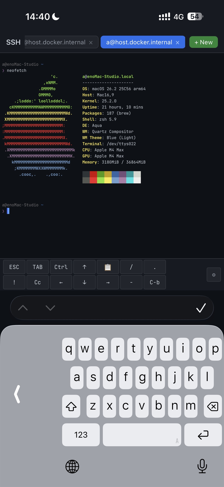

# Web SSH Client

A lightweight, browser-based SSH client built with Node.js and [xterm.js](https://xtermjs.org/). Connect to SSH servers directly from your browser with no plugins or extensions required.

<p align="center">
  
</p>

## Features

- **Browser-based terminal** powered by xterm.js (256-color, Unicode support)
- **Multi-session tabs** with automatic reconnection on page reload
- **Saved connections** with password and private key authentication
- **Mobile-friendly** touch toolbar with customizable keys (ESC, TAB, Ctrl, arrows, function keys, etc.)
- **HTTPS/TLS support** for secure access
- **Docker ready** with a single command deployment

## Quick Start

### Node.js

```bash
git clone https://github.com/yaaayaaa/web-ssh-client.git
cd web-ssh-client
npm install
npm start
```

Open `http://localhost:3000` in your browser.

### Docker

```bash
docker compose up -d
```

## HTTPS / TLS

To enable HTTPS, place your certificate files in the `certs/` directory:

```
certs/
  cert.pem
  key.pem
```

The server automatically detects and uses TLS certificates when present. Without certificates, it falls back to HTTP.

You can also specify custom paths via environment variables:

```bash
TLS_CERT=/path/to/cert.pem TLS_KEY=/path/to/key.pem npm start
```

## Configuration

| Environment Variable | Default | Description |
|---|---|---|
| `PORT` | `3000` (HTTP) / `443` (HTTPS) | Server listen port |
| `TLS_CERT` | `./certs/cert.pem` | Path to TLS certificate |
| `TLS_KEY` | `./certs/key.pem` | Path to TLS private key |

## Architecture

```
Browser (xterm.js) <--WebSocket--> Node.js (Express + ws) <--SSH2--> SSH Server
```

- **Frontend**: Single-page application (`public/index.html`) with xterm.js terminal emulator
- **Backend**: Express server with WebSocket relay to SSH connections via [ssh2](https://github.com/mscdex/ssh2)
- **Data**: Connection credentials stored in `data/connections.json` (local file, gitignored)

## Security Considerations

- Connection credentials are stored in **plaintext** on the server's filesystem (`data/connections.json`). Do not expose this application to untrusted networks without additional access controls.
- Always use HTTPS in production to protect credentials in transit.
- The application has **no built-in authentication**. Consider placing it behind a reverse proxy with authentication, a VPN, or a private network (e.g., Tailscale).

## License

[MIT](LICENSE)
